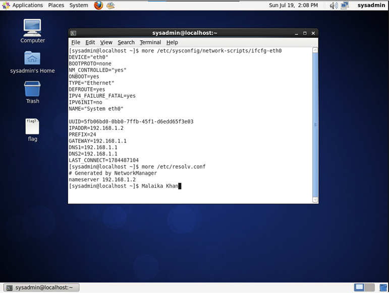
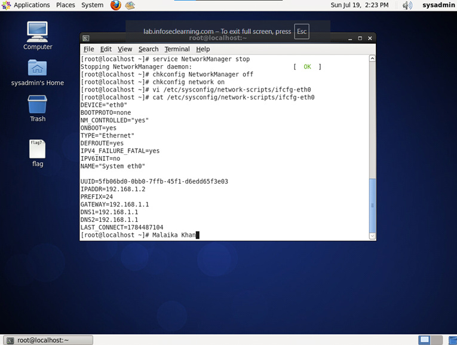
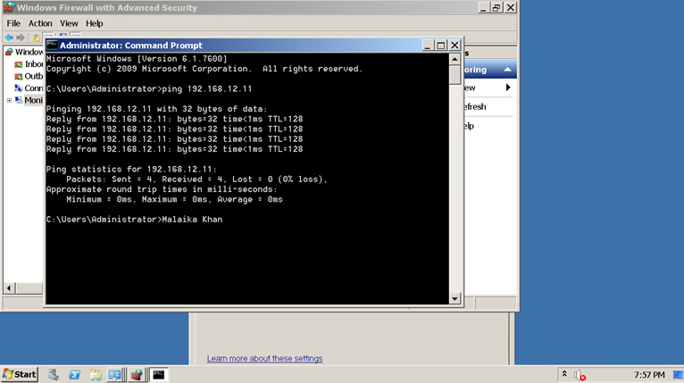
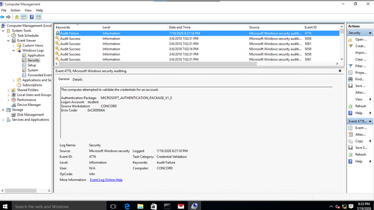

# CYB 230 Module Three Security Labs

## Project Overview

This project documents the hands-on labs I completed for **CYB 230: Operating System Security** at Southern New Hampshire University.

The Module Three labs focused on network configuration, Windows and Linux firewall security, security policies, failed logon auditing, and system hardening.

## Labs Completed

### 1. Basic Network Configuration

I manually configured a CentOS network interface using both **NetworkManager** and the traditional **network service**.

During this lab, I worked with:

- IP addresses
- Subnet masks
- Default gateways
- DNS servers
- Hostnames
- Fully qualified domain names
- The `/etc/hosts` file
- The `/etc/resolv.conf` file

I also practiced using commands such as:

- `ifconfig`
- `route`
- `ping`
- `host`
- `dig`

This lab helped me understand how systems are configured to communicate on a network and how hostname and DNS resolution work.

### 2. Network Security and Firewalls

I worked with Windows Firewall and Windows Firewall with Advanced Security.

I enabled the **File and Printer Sharing Echo Request rule for ICMPv4 traffic**. Before enabling the rule, one Windows server could not successfully ping the other. After enabling the correct inbound rule, all four packets were received with zero packet loss.

I also practiced using Linux firewall rules to control network traffic and block insecure Telnet connections.

This helped me understand how firewall rules can allow or deny traffic based on protocols, ports, and the direction of the connection.

### 3. Implementing Security Policies

I created a customized Windows logon warning and enabled auditing for failed login attempts.

I intentionally entered an incorrect password and then located the resulting **Audit Failure** event in Windows Event Viewer.

I also used Zenmap to examine open ports on a Linux system and practiced applying firewall rules to restrict incoming traffic while still allowing web traffic through port 80.

This lab helped me understand how administrators use security policies, auditing, event logs, and firewall rules to monitor and protect systems.

## Challenge and Solution

I made one small mistake during the network configuration lab. I took one of my screenshots too early, before the complete configuration output was displayed.

Since I needed to include the screenshot in my Module Three worksheet, I returned to the terminal, ran the correct command, and made sure the IP address, gateway, and DNS settings were visible before retaking the screenshot.

This reminded me that technical work is not only about making configuration changes. It is also important to verify the results, pay attention to details, and document the work clearly.

## Skills Practiced

- CentOS network configuration
- Windows and Linux administration
- DNS and hostname resolution
- Windows Firewall management
- Linux firewall configuration
- ICMP connectivity testing
- Failed logon auditing
- Windows Event Viewer
- Group Policy configuration
- Port scanning with Zenmap
- System hardening
- Technical troubleshooting
- Security documentation

## Tools and Technologies

- CentOS Linux
- Windows 10
- Windows Server
- Windows Firewall
- Windows Firewall with Advanced Security
- Windows Event Viewer
- Group Policy Editor
- Linux `iptables`
- Zenmap
- DNS
- ICMP
- Telnet

## Screenshots

### CentOS NetworkManager Configuration

This screenshot shows the manually configured CentOS network interface, including the IP address, gateway, and DNS settings.

### CentOS Network Service Configuration

This screenshot shows the updated CentOS interface configuration after switching from NetworkManager to the traditional network service.

### Successful Windows Firewall Ping

This screenshot shows a successful ping between the two Windows servers after enabling the correct inbound ICMPv4 firewall rule.

### Customized Windows Logon Warning

This screenshot shows the customized security warning displayed before users log in to the Windows system.

### Windows Audit Failure Event

This screenshot shows a failed logon attempt recorded as an Audit Failure event in Windows Event Viewer.

## Key Takeaways

These labs gave me more hands-on experience with Windows and Linux security, network configuration, firewall rules, auditing, and system hardening.

I learned that making a configuration change is only part of the process. It is also important to test the change, verify the results, monitor system activity, and clearly document what was completed.

## Ethical Use Statement

This project was completed in an authorized academic lab environment for educational purposes. No testing was performed against systems without permission.
