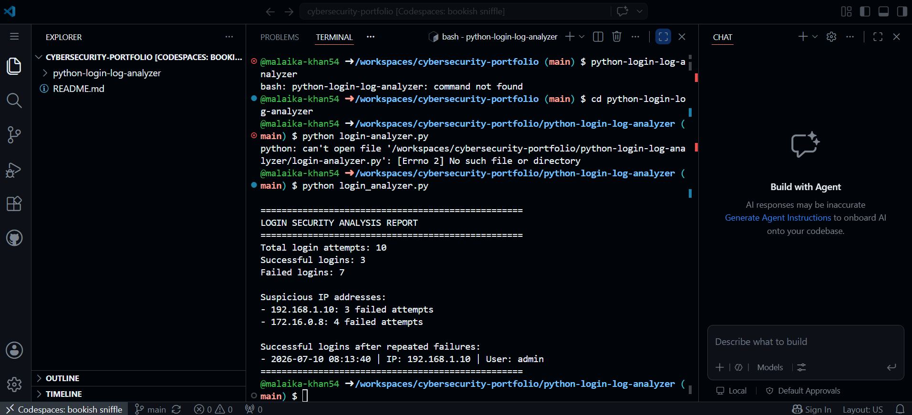

# Python Login Log Analyzer

## About This Project

This is a Python cybersecurity project that analyzes login activity and looks for suspicious behavior.

The program reads login records from a text file and creates a security report.

It can detect:

- Repeated failed login attempts
- Suspicious IP addresses
- Successful logins after several failed attempts
- Activity that may be connected to a brute-force password attack

## How It Works

Each login record contains:

- Date and time
- IP address
- Username
- Login result

The login result is either `SUCCESS` or `FAILED`.

The program flags an IP address when it has three or more failed login attempts.

## Project Files

- `login_analyzer.py` contains the Python code
- `sample_log.txt` contains sample login records
- `login-analyzer-output.png` shows the program output
- `README.md` explains the project

## Technologies Used

- Python
- File handling
- Dictionaries
- Loops
- Functions
- Conditional statements
- Exception handling
- Basic cybersecurity log analysis

## How to Run the Project

Open a terminal inside the project folder and type:

```bash
python login_analyzer.py
```

## Example Output

```text
==================================================
LOGIN SECURITY ANALYSIS REPORT
==================================================
Total login attempts: 10
Successful logins: 3
Failed logins: 7

Suspicious IP addresses:
- 192.168.1.10: 3 failed attempts
- 172.16.0.8: 4 failed attempts

Successful logins after repeated failures:
- 2026-07-10 08:13:40 | IP: 192.168.1.10 | User: admin
==================================================
```

## Project Screenshot



## Skills Demonstrated

This project demonstrates my ability to use Python for:

- Security log analysis
- Suspicious activity detection
- File processing
- Data organization
- Basic threat monitoring

## Future Improvements

In the future, I may add:

- Automatic report creation
- Date and time filtering
- CSV file support
- Username-based tracking
- A graphical interface
- IP location information
